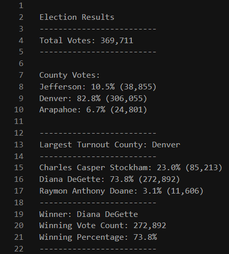

# Election_Analysis

## **Overview of the Election Audit**
A Colorado Board of Elections employee gave me the following tasks to complete the election audit of a recent local congressional election:
1) Calculate the total number of votes cast.
2) Get a complete list of candidates who received votes. 
3) Calculate the total number of votes each candidate received.
4) Calculate the percentage of votes each candidate won. 
5) Determine the winner of the election based on popular vote.
6) Calculate the number of votes and percentage of total votes for each county in the precinct.
7) Determined which county had the largest number of votes.

## **Election-Audit Results**
The analysis of the election shows that:
1) There were 369,711 votes cast in the election.
2) The 3 candidates who received votes were: 
	- Charles Casper Stockham, Diane DeGette, and Raymon Anthony Doane.
3/4) The candidate results were:
	- Charles Casper Stockham received 23.0% of the vote with 85,213 votes.
	- Diane DeGette received 73.8% of the vote with 272,892 votes.
	- Raymon Anthony Doane received 3.1% of the vote with 11,606 votes.
5) The winner of the election was:
	- Diane DeGette, who received 73.8% of the vote with 272,892 votes.
6) The county results were:
	- Jefferson county accounted for 10.5% of the vote with 38,855 of votes.
	- Denver county accounted for 82.8% of the vote with 306,055 of votes.
	- Arapahoe county accounted for 6.7% of the vote with 24,801 of votes.
7) The county with the largest number of votes was:
	- Denver county, which accounted for 82.8% of the vote with 306,055 of votes.
- To supplement the above list with a concise visual, the following is an image of the election results written into our .txt file at the end of the audit.

## **Election-Audit Summary**
In addition to reusing the script to audit another congressional election, the script could be modified to audit other types of elections (e.g., school board, U.S. Senate, U.S. presidential). The script could also be modified to report out additional voter demographic data in each election (e.g., vote totals and percentages by gender, ethnicity, zipcode, income).

## **Resources**
- Data Source: [election_results.csv](election_results.csv)
- Final Code: [PyPoll_Challenge.py](PyPoll_Challenge.py)
- Final Output: [election_results.txt](election_results.txt)
- Software: Python 3.7.6, Visual Studio Code, 1.52.1

